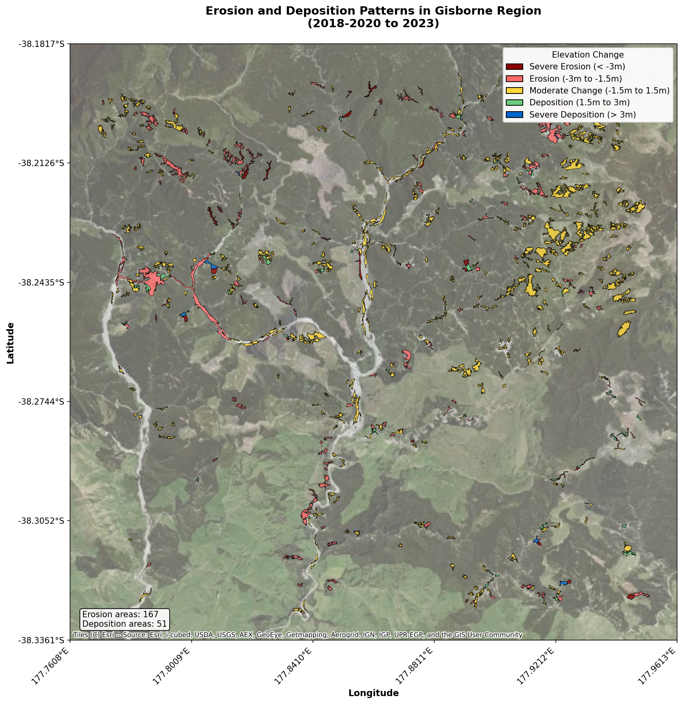
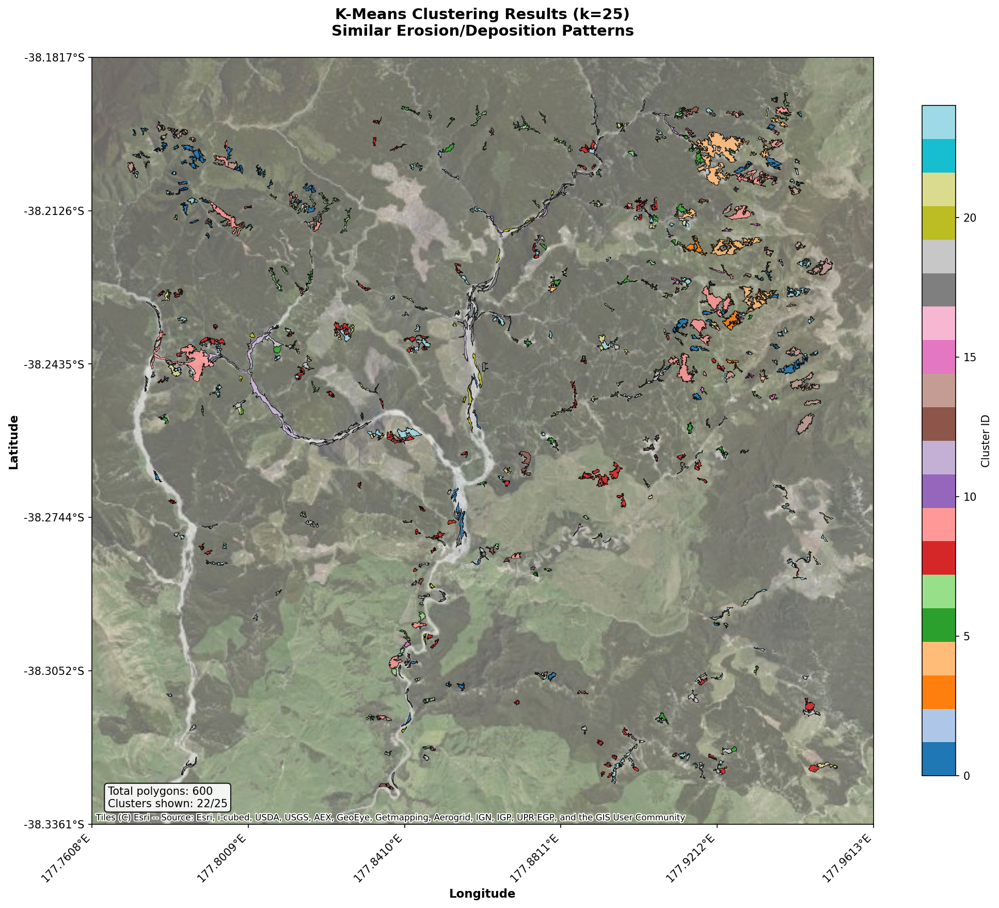

# Rivers - Erosion and Sedimentation Analysis for Gisborne, New Zealand

[](https://github.com/UoA-eResearch/rivers/actions/workflows/process-data.yml)

This repository contains code and data for analyzing erosion and sedimentation patterns in the Gisborne region of New Zealand using Digital Elevation Model (DEM) data from 2018-2020 and 2023, along with NDVI (Normalized Difference Vegetation Index) satellite imagery.

## Table of Contents

- [Overview](#overview)
- [Repository Structure](#repository-structure)
- [How It Works](#how-it-works)
- [Installation](#installation)
- [Usage](#usage)
- [Data Schema](#data-schema)
- [Visualizations](#visualizations)
- [Key Findings](#key-findings)
- [Future Enhancements](#future-enhancements)
- [Data Sources](#data-sources)
- [License](#license)
- [Contributing](#contributing)
- [Citation](#citation)
- [Contact](#contact)

## Overview

The analysis identifies areas of significant elevation change (erosion or deposition > 1m) between two time periods and characterizes these areas using:

- **Terrain attributes**: slope, aspect, curvature, roughness, ruggedness
- **Vegetation indices**: NDVI changes between 2018 and 2023
- **Land cover data**: LCDB (Land Cover Database) classifications
- **Hydrological indices**: WhiteboxTools-based downslope distance to stream, elevation above stream, depth to water
- **River polygons**: Splits analysis polygons based on river polygon boundaries BEFORE feature extraction
- **Clustering**: K-means clustering to identify similar erosion/deposition patterns

## Repository Structure

```
.
├── data/                           # Data files (large files tracked via Git LFS)
│   ├── NDVI_2018.tif              # NDVI raster for 2018
│   ├── NDVI_2023.tif              # NDVI raster for 2023
│   ├── REC2_geodata_version_5.zip # River Environment Classification data
│   ├── lris-lcdb-v50-*.zip        # Land Cover Database
│   ├── lds-nz-river-polygons-*.zip # NZ river polygons
│   ├── areas.parquet              # Processed elevation change polygons
│   ├── areas+NDVI.parquet         # Areas with NDVI features added
│   └── clusters.parquet           # Clustered results
├── src/                            # Python source code
│   ├── batch.py                   # Main processing pipeline
│   └── download_NDVI.py           # Script to download NDVI data from Google Earth Engine
├── notebooks/                      # Jupyter notebooks
│   ├── EDA.ipynb                  # Exploratory data analysis
│   └── clustering.ipynb           # Clustering analysis and visualization
├── .github/workflows/             # GitHub Actions
│   └── process-data.yml           # Automated processing workflow
├── requirements.txt               # Python dependencies
└── README.md                      # This file
```

## How It Works

### 1. Data Processing Pipeline (`src/batch.py`)

The main processing pipeline performs the following steps:

1. **Load Reference Data**
   - Extracts and loads REC2 river network data
   - Loads LCDB land cover classifications
   - Loads river polygon data for splitting analysis areas

2. **Process DEM Tiles**
   - Downloads DEM tiles from AWS S3 (Gisborne 2018-2020 and 2023)
   - Calculates elevation differences
   - Identifies areas with > 1m change using sieving (minimum 4000 m²)
   - **Splits polygons at river boundaries FIRST** (before feature extraction)
   - Computes hydrological indices using WhiteboxTools:
     - DownslopeDistanceToStream: Distance along flow path to nearest stream
     - ElevationAboveStreamEuclidean: Height above nearest stream channel
     - DepthToWater: Depth to water table
   - Extracts terrain features for each (split) polygon

3. **Add NDVI Features**
   - Masks NDVI rasters to each change polygon
   - Calculates statistics (min, max, mean, median, std) for old, new, and difference

4. **Join Results**
   - Combines individual tile results into a single dataset
   - Saves as Parquet files for efficient storage and processing

### 2. Clustering Analysis (`notebooks/clustering.ipynb`)

The clustering notebook:
- Loads the processed data with NDVI features
- Standardizes all features
- Performs K-means clustering (k=25)
- Visualizes results on interactive maps
- Exports clustered data to GeoPackage for GIS software

## Installation

### Prerequisites

- Python 3.11 or higher
- pip package manager
- (Optional) Google Earth Engine account for downloading NDVI data

### Setup

1. Clone this repository:
```bash
git clone https://github.com/UoA-eResearch/rivers.git
cd rivers
```

2. Install dependencies:
```bash
pip install -r requirements.txt
```

3. Download required data files and place them in the `data/` directory:
   - REC2 geodatabase from NIWA
   - LCDB from LRIS portal
   - River polygons from LINZ Data Service
   - NDVI rasters (or generate using `src/download_NDVI.py`)

## Usage

### Running the Batch Processing

Process all DEM tiles and extract features:

```bash
python src/batch.py
```

This will:
- Process 305 DEM tiles from the Gisborne region
- Split polygons at river boundaries BEFORE computing features
- Extract terrain features for ~21,000+ split polygons
- Compute hydrological indices using WhiteboxTools (downslope distance, elevation above stream, depth to water)
- Add NDVI features
- Save results to `data/areas.parquet` and `data/areas+NDVI.parquet`
- Progress is saved incrementally to `tile_results/` directory

**Note**: This is a compute-intensive process that can take several hours to complete.

### Running the Clustering Analysis

Execute the clustering notebook:

```bash
cd notebooks
jupyter notebook clustering.ipynb
```

Or run it from the command line:

```bash
jupyter nbconvert --to notebook --execute notebooks/clustering.ipynb
```

This will:
- Load the processed data
- Perform K-means clustering
- Generate visualizations
- Save clustered results to `data/clusters.parquet` and `data/clusters.gpkg`

### Automated Processing with GitHub Actions

The repository includes a GitHub Actions workflow that automatically runs the processing pipeline. The workflow:
- Runs monthly (or can be triggered manually)
- Executes `batch.py` and `clustering.ipynb`
- Uploads results as artifacts

To trigger manually:
1. Go to the "Actions" tab in GitHub
2. Select "Process Rivers Data"
3. Click "Run workflow"

## Data Schema

### Features Extracted

For each erosion/deposition polygon, the following features are extracted:

**Elevation Statistics** (old, new, diff):
- `min`, `max`, `mean`, `median`, `std`: Basic statistics

**Terrain Attributes** (old, new, diff):
- `roughness_*`: Surface roughness
- `slope_*`: Terrain slope
- `aspect_*`: Slope direction
- `curvature_*`: Surface curvature
- `terrain_ruggedness_index_*`: TRI measure
- `rugosity_*`: Surface complexity
- `profile_curvature_*`: Curvature in slope direction
- `planform_curvature_*`: Curvature perpendicular to slope

**NDVI Statistics** (old, new, diff):
- `NDVI_*_min`, `NDVI_*_max`, `NDVI_*_mean`, `NDVI_*_median`, `NDVI_*_std`

**Hydrological Indices** (from WhiteboxTools):
- `downslope_dist_mean`, `downslope_dist_median`, `downslope_dist_std`: Distance to stream along flow path
- `elevation_above_stream_mean`, `elevation_above_stream_median`, `elevation_above_stream_std`: Height above stream channel
- `depth_to_water_mean`, `depth_to_water_median`, `depth_to_water_std`: Depth to water table

**Context Features**:
- `area`: Polygon area in m²
- `distance_to_river`: Distance to nearest river (m)
- `Class_2018`: LCDB land cover class
- `Wetland_18`: Boolean wetland flag
- `Onshore_18`: Boolean onshore flag
- `split_by_river`: Boolean flag indicating if polygon was split by river boundary

## Visualizations

### Elevation Changes

The analysis identifies significant elevation changes across the Gisborne region:



### Clustering Results

K-means clustering groups similar erosion/deposition patterns:



### Interactive Maps

The clustering notebook generates interactive Folium maps that can be explored in a web browser, showing:
- Cluster assignments
- Feature values on hover
- Satellite imagery basemap

## Key Findings

The analysis of ~21,886 erosion and deposition polygons across the Gisborne region reveals:

1. **Spatial Patterns**: Erosion and deposition areas are strongly associated with proximity to rivers and streams
2. **Vegetation Changes**: NDVI differences show vegetation recovery or loss in changed areas
3. **Terrain Controls**: Slope, aspect, and curvature are important controls on erosion patterns
4. **Cluster Diversity**: 25 distinct clusters capture the variety of erosion/deposition signatures

## Future Enhancements

Planned additions to this analysis:

- [ ] **Borselli's connectivity matrix**: Calculate sediment connectivity indices using slope and land cover
- [ ] **K-means weighting**: Implement weighted clustering for imbalanced features
- [ ] **Additional terrain indices**: Calculate TWI (Topographic Wetness Index), SPI (Stream Power Index)

## Data Sources

- **DEM Data**: LINZ Gisborne 1m DEM (2018-2020, 2023) via AWS S3
- **NDVI Data**: Copernicus Sentinel-2 via Google Earth Engine
- **River Network**: NIWA River Environment Classification (REC2) v5
- **Land Cover**: Manaaki Whenua LCDB v5.0
- **River Polygons**: LINZ NZ River Polygons (Topo 150k)

## License

This project is licensed under the MIT License - see the [LICENSE](LICENSE) file for details.

## Contributing

Contributions are welcome! Please feel free to submit a Pull Request.

## Citation

If you use this code or data in your research, please cite:

```
Rivers - Erosion and Sedimentation Analysis
University of Auckland eResearch
https://github.com/UoA-eResearch/rivers
```

## Contact

For questions or issues, please open an issue on GitHub or contact the eResearch team at the University of Auckland.
